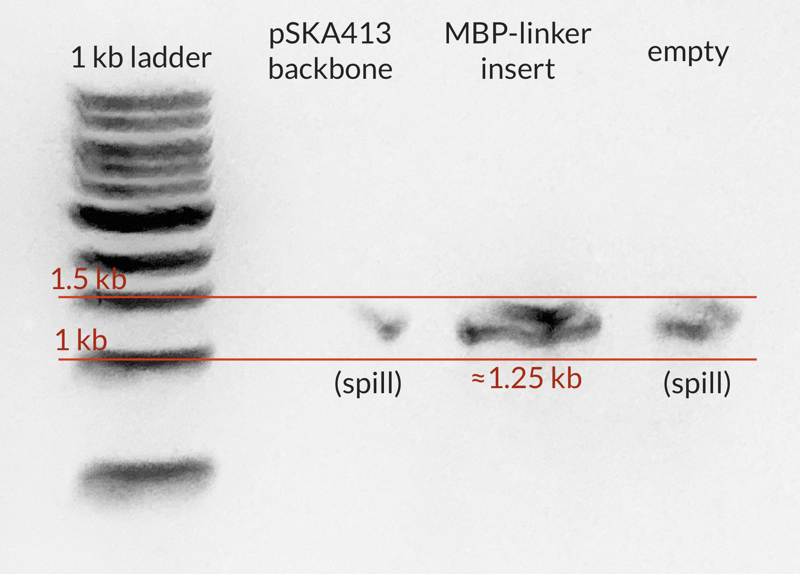
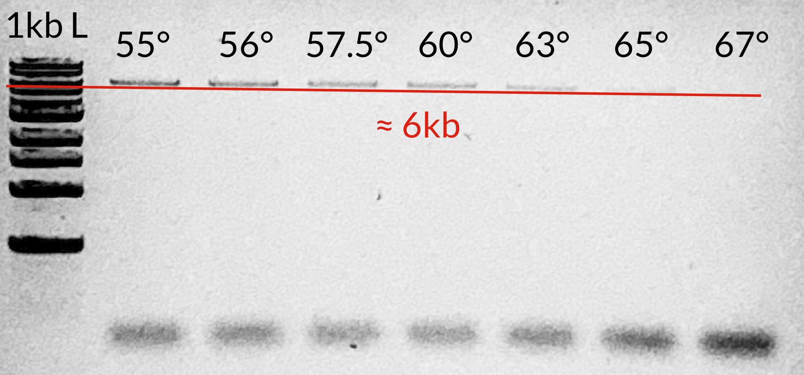
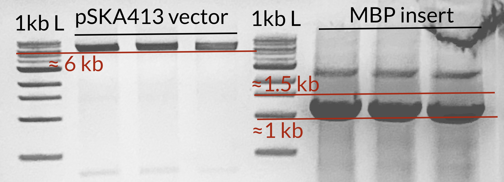
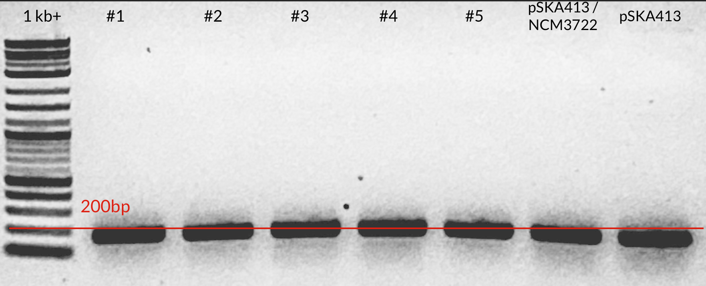

# Cloning of pZE31-MBP-sfGFP

## Purpose
This markdown file contains my notes summarizing the cloning steps undertaken to
create pZE31-ccaS/R_MBP-sfGFP, a light-inducible MBP-sfGFP fusion. This acts as a 
longer version of sfGFP, which is needed to account for the transcription, translation,
folding, and maturation time of sfGFP. This is akin ot using the lacZ-alpha isoform 
as described in Dai et al. 2016. 

## Templates

| **Plasmid Name** | **Source** | **Notes**|
|--|--|--|
|pSKA413| [Addgene 80381](https://www.addgene.org/80381/) | Expresses sfGFP from CpcG2d59 promoter. Also constitutively expresses ccaSR|
|pSub-MBP-sfGFP | [Addgene 18757](https://www.addgene.org/185757/) | Expresses MBP-sfGFP with a TEV linker. |

## Primers
| **Primer Name** | **Sequence (5' -> 3')** | **Notes** |
|--|--|--|
|GCp125_pZE31-MBP_FWD | `aggcacgtaaggcaccatataatgaaa` `actgaagaaggtaaactggtaatctg` | Anneals to pSub-MBP-sfGFP, with homology to promoter of pSKA413. Amplifies MBP-linker |
|GCp126_pZE31-MBP_REV | `gtgaaaagttcttctcctttacg` `catggatccaccggaaccttg`| Anneals to pSub-MBP-sfGFP, with homology to promoter of pSKA413. Amplifies MBP-linker |
|GCp127_pZE31-GFP_FWD | `atgcgtaaaggagaagaacttttcac`| Anneals to pSKA413. Amplifies backbone. |
|GCp128_pZE31-GFP_REV | `tatatggtgccttacgtgcct` | Anneals to pSKA41. Amplifies backbone. |
|GCp129_pZE31-MBP_REV | `atgttgcatcaccttcaccc` | Sequencing primer. Reads reverse strand from beginning of sfGFP to promoter |
|GCp130_pZE31-MBP_FWD| `cttcaattttactttgttaggatcgcattc` | Sequencing primer. Reads forward strand from CpcG2d59 promoter into insert |

## Strain + Locations 

| **Strain Identifier** | **Notes** | 
|--| --|
| GC001 | WT E. coli (NCM3722) |
| GC121 | pSKA413 in DH5alpha |
| GC122 | pSub-MBP-sfGFP in DH5alpha|
| GC123 | pSKA413 in NCM3722 |

## Cloning Steps

<b>January 23 - 25, 2024: Amplification of cloning fragments</b>

### First attempt
The first attempt to clone pZE31-ccaS/ccaR_MBP-sfGFP from agar stabs received from 
addgene. I set up two PCR reactions (2 x 50 µL reactions each),

1. GC127 + GC128 + cell debris from pSKA413 agar stab. 
2. GC125 + GC126 + cell debris from pSub-MBP-sfGFP agar stab.

using the following program:

1. Boil @ 98° C for 8m
2. Denaturation @ 95° C for 30s 
3. Annealing @ 60° C for 30s 
4. Elongation @ 72° C for 3m 
5. Return to #2 x 24
6. Final elongation @ 72° C for 5 min
7. Hold @ 4° C

I ran 5 µL of each reaction on a 1% TAE Gel with the following image:

There was some spillage of the MBP-linker insert into the adjacent wells, but that reaction seemed to work. Amplification of the backbone *did not* work. 

### Second attempt
I purified the pSKA413 plasmid from a saturated overnight culture yielding 50 µL of ≈ 160 ng/µL aliquot. Using around 8 ng, I set up an annealing temperature gradient (55° - 68° C) with the following program:

1. Boil @ 98° C for 2m
2. Denaturation @ 95° C for 30s 
3. Annealing @ 55 - 68° C for 30s 
4. Elongation @ 72° C for 3m30s 
5. Return to #2 x 24
6. Final elongation @ 72° C for 5 min
7. Hold @ 4° C

... but saw no bands (maybe some faint primer dimers). 

I set up another gradient PCR using the same settings as that above, but changing 
the elongation time (step 4) to 6m15s, as suggested by Promega (1m per kb). I ran 
this PCR overnight and ran a gel in the morning. 

This seemed to work, but I had *a lot* of minor product. I decided to move forward 
in cleaning up this fragment (and the MBP tag insert), yieling ≈65 ng / uL of insert
and 0 for the vector. I'll rerun both amplifications and do a gel extraction.  

<b>January 29 - 30 , 2024: Amplification of Fragments for Gel Extraction</b>

I set up 200µL total reaction volume (4 x 50µL) for both the insert and the vector using
the following amplification protocol:

1. Boil @ 98° C for 2m
2. Denaturation @ 95° C for 30s 
3. Annealing @ 55 - 68° C for 30s 
4. Elongation @ 72° C for 3m30s 
5. Return to #2 x 24
6. Final elongation @ 72° C for 5 min
7. Hold @ 4° C

I loaded ≈150 µL total of each reaction in the gel, which is shown below:

I cut out the relevant bands from the gel to do a purification followed by a gibson assembly, 
and got terrible yields, with ≈15 and ≈180 ng / µL for the vector and insert, respectively. 

Regardless, I set up a Gibson assembly using ≈60 ng of vector and ≈180 ng of insert 
in a total of 10µL reaction volume. I incubated at 50°C for 45 minutes and drop dialyzed 
for 45 m before transforming into NCM3722 competence cells. After 1 hour of recovery in LB,
I plated 10, 100, and whole culture volumes onto plates.

<b>January 31, 2024: Colony PCR of Possible Transformants and Vector Reamplification</b>

### Screening Transformants
There were 5 major colonies (one minor) on the whole-cell transformation plate 
from yesterday. I picked these 5 plus one of (what I think is) pSKA413 in NCM3722
and set up a colony PCR amplifying with primers GCp129 and GCp130. I also ran 
one positive control using around 2 ng of the  purified pSKA413 plasmid. I ran 
the colony PCR with the following program. 

1. Boil @ 98° C for 8m
2. Denaturation @ 95° C for 30s 
3. Annealing @ 60° C for 58s (Meant to set the annealing temp to 58, whoops.)
4. Elongation @ 72° C for 2m 
5. Return to #2 x 24
6. Final elongation @ 72° C for 5 min
7. Hold @ 4° C

I ran ≈ 10 µL of each sample on a 1.5% agarose gel with a 1 Kbplus ladder, shown below:

All transformants came back positive for containing only pSKA413, matching with 
the positive control (last lane). This isn't too surprising considering I had 
such a horrible yield of purifying the vector from the gel. 

### Reamplification of pSKA413 Vector

I think part of the low yield of the pSKA413 vector comes from the fact that 
using the Green GoTAQ polymerase requires a 6m elongation time. I reset the vector
amplification using GCp127 and GCp128 using a Q5 polymerase following the 
instructions to a tee. I set up a 4 x 50µL reaction using the purified pSKA413 as 
a template with a final concentration of around 2 ng / reaction. I ran the PCR 
with the following protocol:

1. Boil @ 30° C for 8m
2. Denaturation @ 98° C for 10s 
3. Annealing @ 64° C for 30s 
4. Elongation @ 72° C for 3m 
5. Return to #2 x 24
6. Final elongation @ 72° C for 2 min
7. Hold @ 10° C

